## 🖥️ Manual de Instalación para PC o Laptop

---

### ✅ Paso 1: Ejecutar Instalador

Hacer doble clic en el archivo instalador.

---

### ⚠️ Paso 2: Advertencia de Seguridad

Si ves esta advertencia de Windows, haz clic en **"Más información"** y luego en **"Ejecutar de todas formas"**.

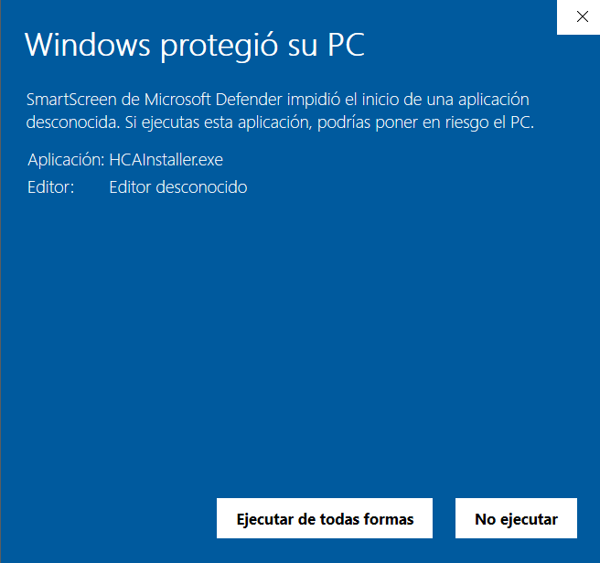

---

### 🛡️ Paso 3: Confirmación del Sistema

Selecciona la opción **"Sí"** cuando Windows pregunte si deseas permitir cambios.

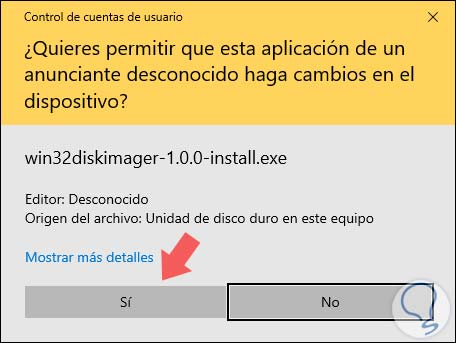

---

### 📜 Paso 4: Aceptar Términos de Licencia

Aceptar los términos de la licencia y hacer clic en **"Next"**.

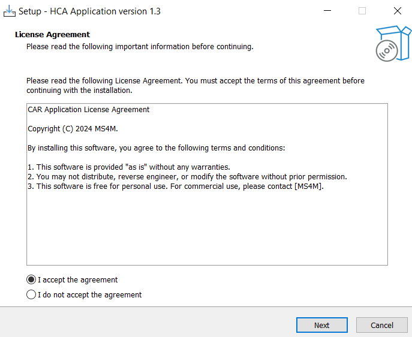

---

### 📁 Paso 5: Ruta de Instalación

Deja la ubicación por defecto y haz clic en **"Next"**.

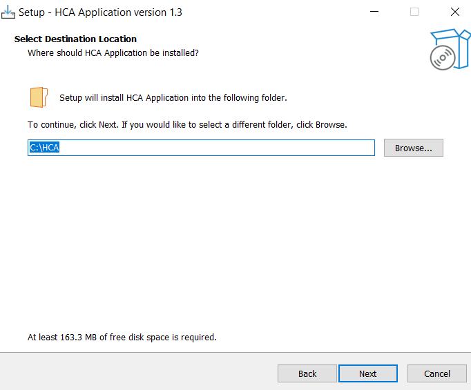

---

### ⚙️ Paso 6: Configuración adicional

Deja la opción por defecto y haz clic en **"Next"**.

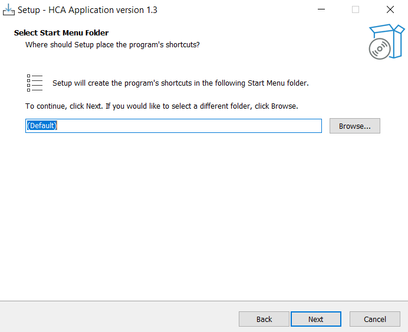

---

### 🚀 Paso 7: Iniciar Instalación

Haz clic en **"Install"** para comenzar la instalación.

> ⚠️ _Nota: Asegúrate de no cerrar el instalador durante este proceso._

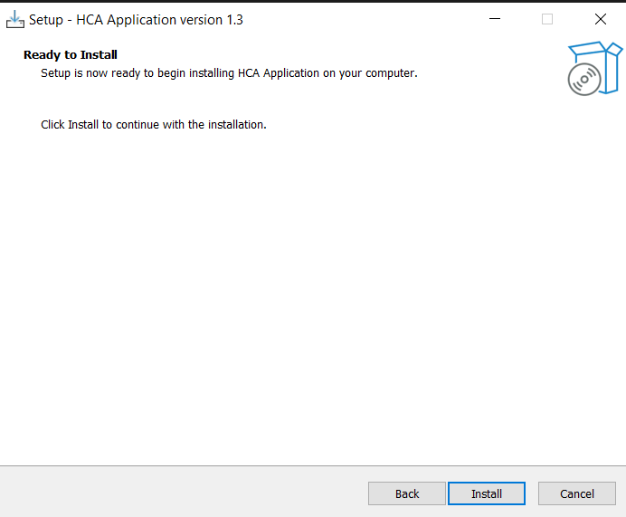

---

### ⏳ Paso 8: Esperar finalización

Aguarda unos minutos mientras se completa el proceso de instalación.

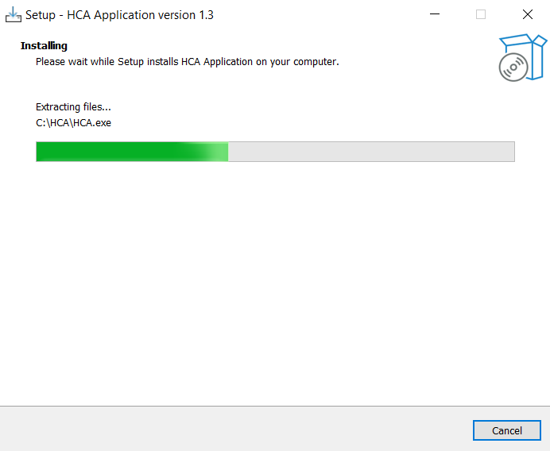

---

### ✅ Paso 9: Finalizar

Haz clic en **"Finish"** para terminar la instalación.

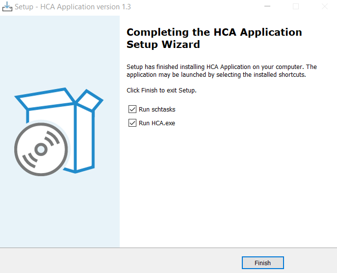

---

### 🔎 Paso 10: Buscar el Icono

Abre la aplicación desde el ícono en la bandeja del sistema (cerca del reloj).

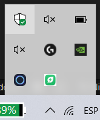

---

### 👆 Paso 11: Iniciar Sesión

Haz clic derecho en el ícono y selecciona **"Login"**.

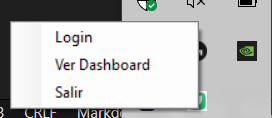

---

### 🔐 Paso 12: Ingreso de Credenciales

Introduce tu **correo** y **contraseña**, luego haz clic en **"Iniciar"**.

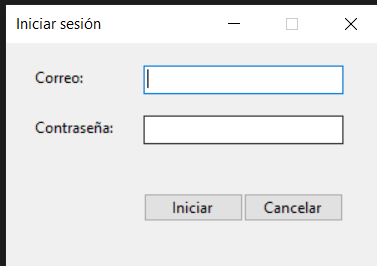

---

### 🎉 Paso 13: Confirmación de Sesión

Al iniciar sesión correctamente, verás un mensaje de confirmación.

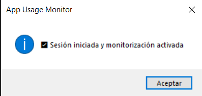

---

## ⚙️ Otras opciones desde el menú:

En el mismo menú donde se inicia sesión, también están disponibles las siguientes opciones:

- **"Logout"**: Cierra la sesión actual. Aparecerá un mensaje de confirmación.
- **"Ver Dashboard"**: Te redirige a la página web donde podrás consultar tu **huella de carbono digital**.

